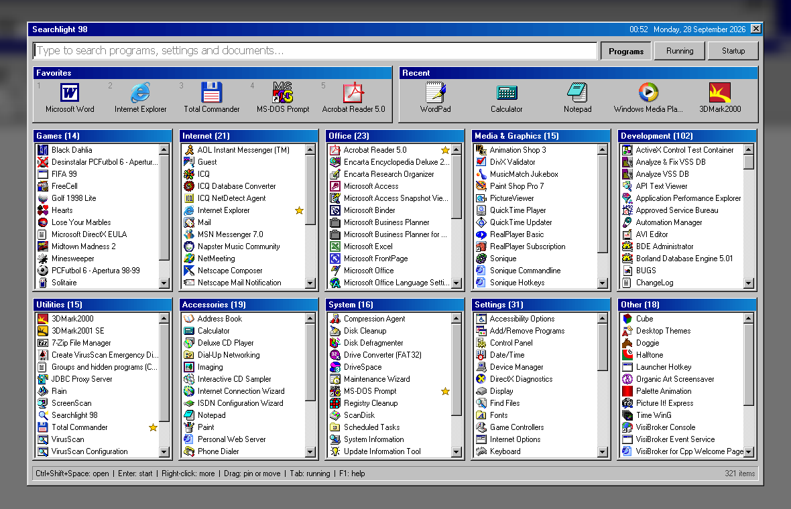
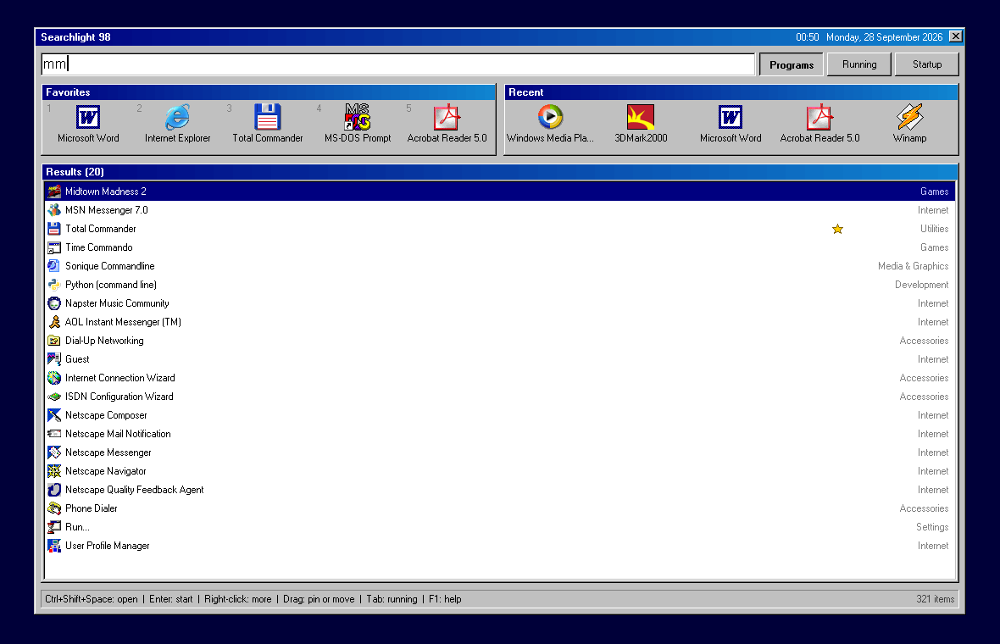
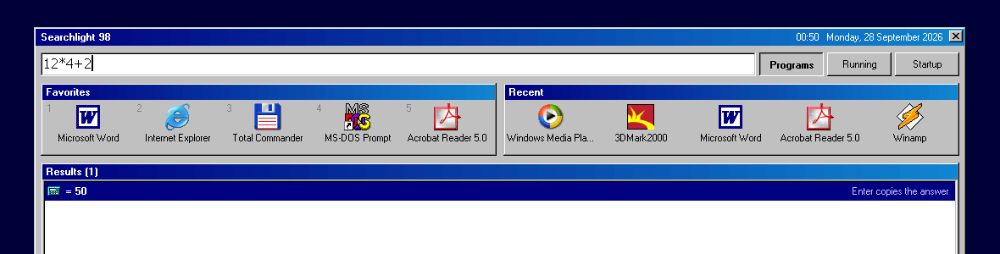
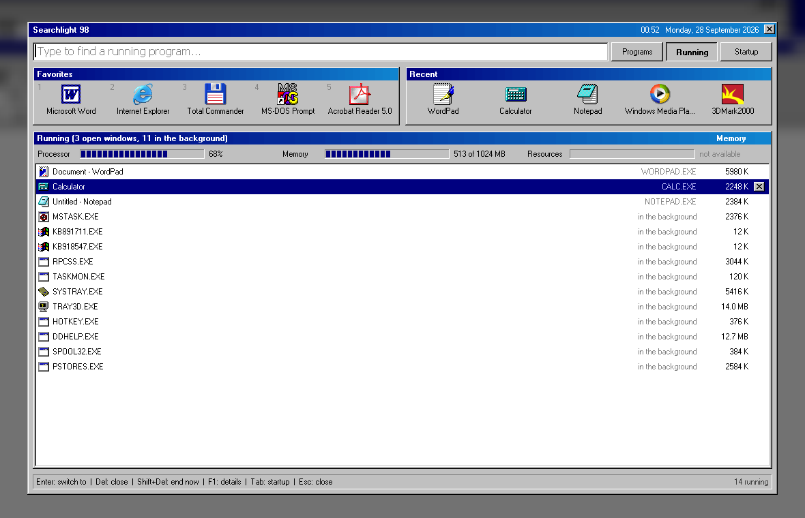
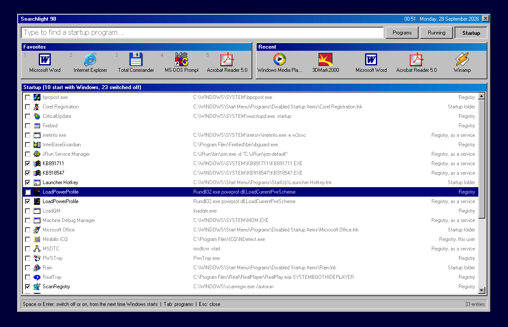

# Searchlight 98

[](https://github.com/sguri/searchlight98/actions/workflows/build.yml)
[](https://github.com/sguri/searchlight98/releases/latest)
[](LICENSE.TXT)

A keyboard-driven program launcher for Windows 95 and Windows 98.

Press **Ctrl+Space** in any program, type a few letters and press **Enter**. Searchlight opens a
panel over the desktop with every Start Menu program sorted into groups, a search box, favorites,
recently used programs and the Control Panel settings. It also lists running programs and the
programs that start with Windows.

Searchlight 98 is a single native executable of about 140 KB, written in C against the Win32 API.
It has no dependencies beyond the operating system.



## Features

### Finding and starting programs

- Search across programs, Control Panel settings and documents. Names, word starts and initials
  all match: `mm` finds *Midtown Madness*, `res` finds *Display*, `uninstall` finds
  *Add/Remove Programs*.
- Programs are grouped automatically: Games, Internet, Office, Media & Graphics, Development,
  Utilities, Accessories, System and Settings. Drag a program onto another group to move it.
- Up to five favorites, pinned by drag and drop, each with a global hotkey
  (**Ctrl+Alt+1** to **Ctrl+Alt+5**).
- The five most recently started programs.
- Results are ranked by how often each program is started.
- Documents from My Documents and the recent documents list, ranked below programs.
- A context menu with Open, Open Containing Folder, Properties, Pin, Hide and, where the matching
  Add/Remove Programs entry can be identified, Uninstall.

### Commands in the search box

| Input | Result |
|---|---|
| `12*4+2` | Evaluates the expression. Enter copies the result to the Clipboard. |
| `notepad c:\autoexec.bat` | Runs a program, as Start, Run does. Paths and web addresses also work. |
| `800x600` or `1024x768 16` | Changes the screen mode. The previous mode is restored unless confirmed within 15 seconds. |
| `shutdown in 30` | Shuts down or restarts Windows after the given number of minutes. |
| `restart`, `log off`, `stand by` | Power commands, each with a confirmation. |





### Running programs

- Lists every open window, followed by background processes. Type to filter.
- Enter switches to a window. Del closes it. Shift+Del ends a process after confirmation.
- Windows that have stopped responding are marked.
- Gauges for processor, memory and system resources, and the memory used by each program.
- Components of Windows itself cannot be ended.



### Startup programs

- Lists everything that starts with Windows: the `Run` and `RunServices` registry keys, the
  Startup folders and `WIN.INI`.
- Each entry can be switched off and on again. Nothing is deleted.
- Disabled entries are stored where the Windows 98 System Configuration Utility (`msconfig`)
  stores them, so the two tools are interchangeable.



### Other

- Tray icon with a menu, and configurable hotkeys.
- A blurred, darkened backdrop while the panel is open, with adjustable opacity. Windows 95 and
  98 have no window transparency, so the screen is captured at quarter size, blurred, darkened
  and painted in a full-screen window behind the panel. The effect disables itself on slow
  hardware.
- Icons can be switched off separately for programs, running programs and startup programs. A
  coloured square with the initial of the name is shown in their place.
- Setup program with uninstaller.

## Requirements

- Windows 95, Windows 98, Windows 98 Second Edition or Windows Millennium Edition
- 640 x 480 display or larger
- 1 MB of memory, 300 KB of disk space

Searchlight also runs on Windows NT 4.0 and Windows 2000, with the limitations listed under
[Platform notes](#platform-notes).

## Installation

Download the latest version from the
[Releases](https://github.com/sguri/searchlight98/releases/latest) page. Each release provides:

| File | Use |
|---|---|
| `SL98SETUP.EXE` | The setup program. Copy it to the target computer and run it. |
| `Searchlight98-x.y.z.iso` | A CD image with the setup program, for virtual machines and for writing to a disc. It starts the setup program when inserted. |

The setup program installs to `C:\Program Files\Searchlight 98`, adds a Start Menu group and can
start Searchlight with Windows. It includes an uninstaller.

To build the setup program from source, see [Building](#building).

## Usage

| Action | Keys |
|---|---|
| Open or close the panel | Ctrl+Space |
| Open the running programs | Ctrl+Shift+Space |
| Move through the results | Up, Down, Page Up, Page Down |
| Start the selected item | Enter |
| Switch between Programs, Running and Startup | Tab, Shift+Tab |
| Pin or unpin a search result | F2 |
| Rescan programs and documents | F5 |
| Help, or details in the Running view | F1 |
| Clear the search box, or close the panel | Esc |

Hotkeys can be changed from the tray icon menu. The full user guide is installed as `README.TXT`
and is available in this repository as [`app/README.TXT`](app/README.TXT).

## Configuration

| File | Purpose |
|---|---|
| `CATEGORY.TXT` | Assigns programs to groups, or hides them. Searchlight writes this file when a program is dragged to another group or hidden from the context menu. |
| `EXTRA` folder | Shortcuts placed here are listed in addition to the Start Menu. |
| `STATE.TXT` | Favorites, recent programs and usage counts. |
| `SLIGHT98.LOG` | Start-up diagnostics. |

Hotkeys and options are stored in the registry under `HKEY_CURRENT_USER\Software\Searchlight 98`.
Both are changed from the tray icon menu.

| Option | Default | Effect |
|---|---|---|
| Show icons in the programs and results | On | Off shows initials and loads no program icons. |
| Show icons in the running programs | On | |
| Show icons in the startup programs | On | |
| Load icons only when they come into view | On | Off loads all program icons in the background after start-up. |
| Darken the rest of the screen | On | |
| Opacity | 55% | 0% leaves the screen unchanged. 100% is black and skips the screen capture. |
| Ctrl+Alt+1 to 5 start the favorites | On | |

## Building

Requirements:

- [Tiny C Compiler 0.9.27](http://download.savannah.gnu.org/releases/tinycc/), 32-bit Windows build
- [Inno Setup 5.4.3](https://files.jrsoftware.org/is/5/), non-Unicode. This is the last release
  that supports Windows 95 and 98.
- Windows PowerShell

```powershell
.\build\build.ps1 -Tcc C:\tools\tcc\tcc.exe -Iscc "C:\tools\Inno Setup 5\ISCC.exe"
```

The script compiles `SLIGHT98.EXE`, runs the self-test and writes the setup program to
`dist\SL98SETUP.EXE`. The build runs on current versions of Windows.

## Testing

Two command line switches run the program without creating a tray icon, registering hotkeys or
changing any system setting.

```
SLIGHT98.EXE /selftest              reads TESTS.TXT, writes SELFTEST.OUT
SLIGHT98.EXE /shot PANEL.BMP [text] renders the panel to a bitmap
```

`build.ps1` runs the self-test and compares its output with `tests\EXPECTED.OUT`. The tests cover
grouping, search ranking, the expression evaluator, command recognition, favorites, usage counts,
group overrides and uninstall matching.

`/shot` accepts search text, or one of `/running`, `/startup`, `/hover`, `/recent`, `/drag`,
`/group`, `/hotkeys`, `/options`, `/about`, `/tab` and `/tab2` to render a specific state.
`/noicons` and `/opacity N` in front of these set the corresponding options first. `/shot` uses
fixed sample data for running programs, startup entries and documents, so its output does not
depend on the computer it runs on.

## Source layout

| Path | Contents |
|---|---|
| `src/*.c`, `src/slight98.h` | The program. See [Source files](#source-files) |
| `src/icon.h` | The program icon as C data, generated from `app/SLIGHT98.ICO` |
| `src/*.def` | Import definitions for system libraries not covered by the compiler |
| `app/` | Files installed with the program: user guide, `CATEGORY.TXT`, icon |
| `installer/SLIGHT98.ISS` | Inno Setup script |
| `build/build.ps1` | Build script |
| `build/make-art.ps1` | Generates the icon and the setup artwork |
| `tests/` | Self-test input and expected output |
| `docs/` | Screenshots |
| `.github/` | Build workflow, issue and pull request templates |

### Source files

| File | Contents |
|---|---|
| `slight98.h` | Constants, types, the shared state, and the functions each file offers to the others |
| `main.c` | Start-up, the background window that receives the hotkeys, the tray icon |
| `common.c` | Shared state and small helpers |
| `catalog.c` | The list of programs, settings and documents: scanning the Start Menu, grouping |
| `state.c` | Favorites, recent programs and usage counts, kept in `STATE.TXT` |
| `icons.c` | Icons of programs and files |
| `search.c` | Searching and ranking |
| `commands.c` | Calculations, commands to run, screen modes, countdowns, shutting down |
| `running.c` | Running programs, their memory, and the gauges |
| `startup.c` | Programs that start with Windows |
| `hotkey.c` | Hotkeys and the settings kept in the registry |
| `backdrop.c` | The blurred, darkened picture behind the panel |
| `panel.c` | The panel: layout, contents, opening and closing |
| `actions.c` | What happens when an entry is chosen: starting, pinning, closing, the right-click menu |
| `draw.c` | Drawing the panel |
| `input.c` | Mouse and keyboard handling, drag and drop |
| `dialogs.c` | The Hotkeys, Options and About boxes |
| `test.c` | The self-test and rendering the panel to a bitmap |

All files are compiled and linked in one step. A function or variable used by one file only is
declared `static` in that file.

## Implementation notes

**Grouping.** The Start Menu folder names and the name of each shortcut are matched against an
ordered list of keyword rules (`g_rules` in `catalog.c`). The first matching rule determines the
group. Entries in `CATEGORY.TXT` take precedence.

**Memory.** Searchlight stays loaded, so its idle footprint is kept small.

- An entry of the program list is 48 bytes. Its text is stored packed in a pool, about 120 bytes
  per entry on a typical system.
- Small icons are loaded when a row is first drawn. Large icons are loaded only for Favorites,
  Recent and the drag cursor.
- The backdrop keeps the quarter-size picture only. It is enlarged with bilinear blending in
  bands of 32 rows while painting, so no full-screen bitmap is held.
- The tables for running programs, startup entries and their icons are allocated when the panel
  opens and freed when it closes. The group override table exists only during a scan.

The Details box (F1 in the Running view) reports the memory in use by Searchlight itself, split
into the program with its data and the Windows libraries it has loaded.

Measured on Windows 98 Second Edition with 321 entries listed, the panel open on the Running
view and the backdrop off: 420 KB for the program and its data, and 2.9 MB in six shared Windows
libraries. The shell loads further libraries into the process when programs are started through
it, so the second figure grows with use.

**Character set.** Files read on Windows 95 and 98 use Windows line endings and the Windows-1252
character set in the working tree. Git stores them as UTF-8. See `.gitattributes`.

## Platform notes

- **Processor time per program is not available.** Windows 95 and 98 do not record it. The
  processor gauge shows the system-wide figure from `HKEY_DYN_DATA\PerfStats`, the source used by
  System Monitor.
- **Memory per program excludes shared libraries.** The figure is the committed part of the
  private address space, measured with `VirtualQueryEx`, minus the regions that belong to loaded
  libraries, which are listed with the ToolHelp functions. Libraries are shared between programs
  and held in memory once, so counting them for each program overstates its size. The program
  file itself is counted.
- **The system resources gauge requires Resource Meter.** The figure is read through `RSRC32.DLL`,
  which is part of the optional System Tools component of Windows. Without it the gauge shows
  "not available".
- **Processor cooling utilities affect the processor gauge.** Programs such as Rain, Waterfall
  and CpuIdle run an idle thread that halts the processor. Windows counts that thread as load and
  reports 100% while they run. System Monitor behaves the same way.
- **Windows NT 4.0 and Windows 2000** do not provide the performance counters or system
  resources. Windows NT 4.0 also lacks the process list, so only open windows are shown.
- **Restart in MS-DOS Mode** is offered only if Windows has created `Exit To Dos.pif`, which it
  does the first time that option is used from the Shut Down dialog.

## Contributing

See [CONTRIBUTING.md](CONTRIBUTING.md) for how to report problems, build, test and submit
changes. Changes are listed in [CHANGELOG.md](CHANGELOG.md). Security problems are reported as
described in [SECURITY.md](SECURITY.md).

## License

MIT. See [`LICENSE.TXT`](LICENSE.TXT).

Windows is a registered trademark of Microsoft Corporation. This project is not affiliated with
or endorsed by Microsoft.
